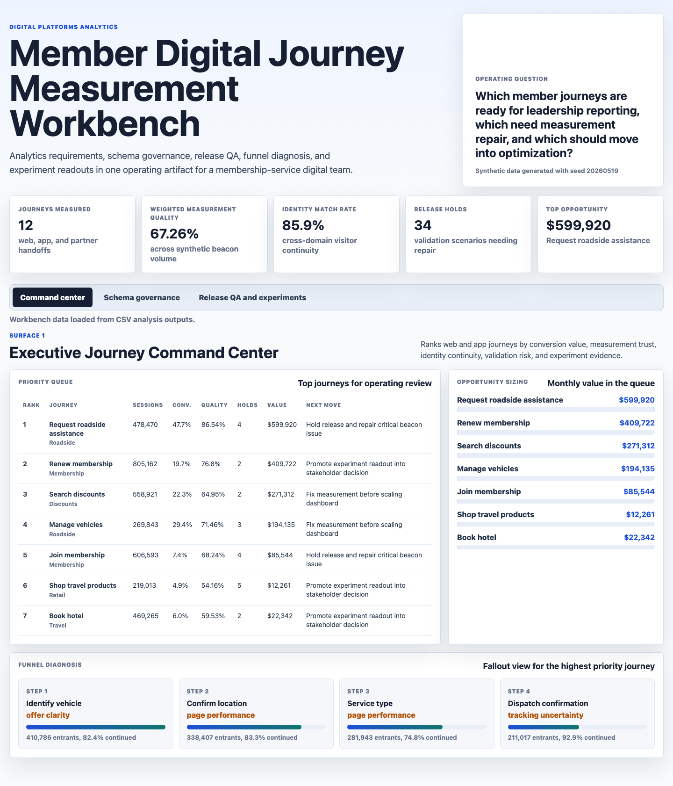
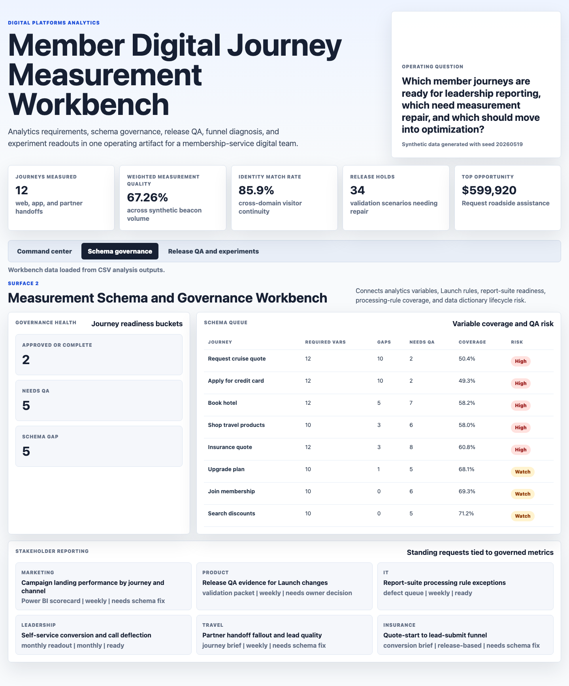
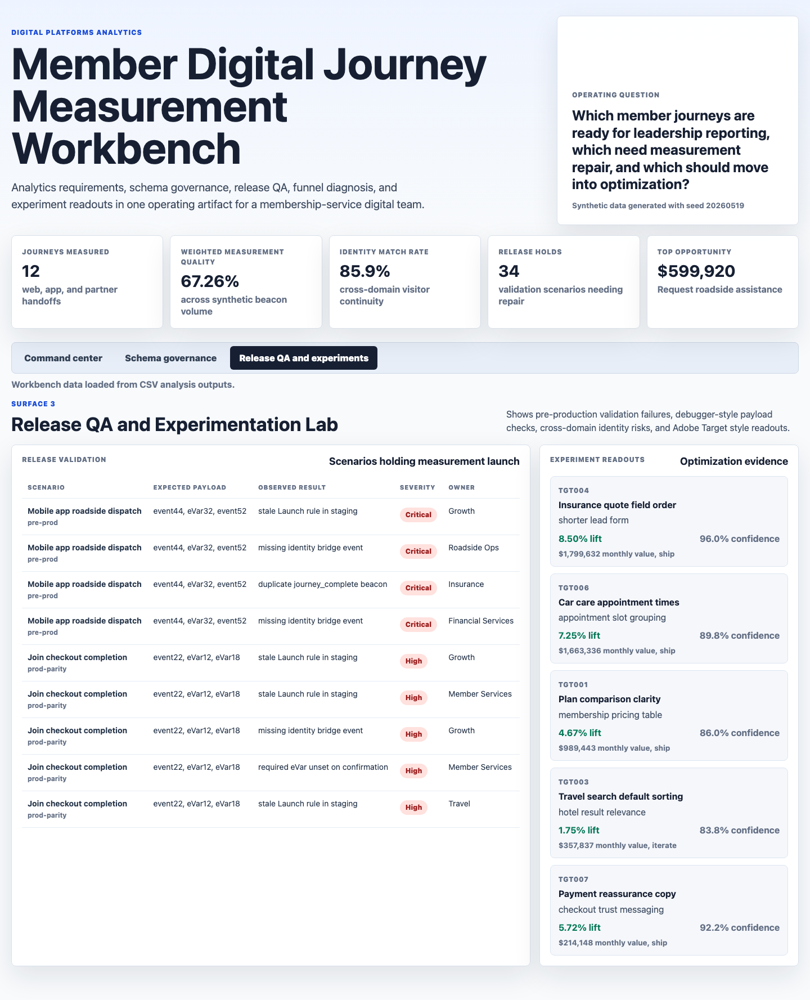

# Member Digital Journey Measurement Workbench

An interactive digital platforms analytics artifact for a membership-services organization with web, mobile app, roadside, travel, insurance, discounts, retail, automotive, and financial-service journeys. The workbench shows how an analytics specialist can move beyond dashboard production by connecting KPI reporting, Adobe-style schema governance, release QA, cross-domain identity checks, funnel analysis, and experiment readouts into one operating workflow.

## What This Project Demonstrates

This artifact is built for a role that owns digital channel analytics reporting, Adobe Analytics and Launch requirements, dashboard-ready KPIs, data dictionary governance, validation scenarios, cross-domain tracking, funnel analysis, and stakeholder recommendations.

The core question is:

Which member journeys are ready for leadership reporting, which need measurement repair, and which should move into optimization?

## Screenshots



**Executive journey command center:** ranks member journeys by conversion value, measurement trust, identity continuity, validation risk, and experiment evidence. The queue translates web and app analytics into a clear next move for each journey.



**Measurement schema and governance workbench:** shows Adobe-style variable coverage, Launch rule readiness, processing-rule risk, data dictionary lifecycle gaps, and stakeholder reporting requests that depend on governed metrics.



**Release QA and experimentation lab:** turns validation scenarios into a release gate and pairs debugger-style payload findings with Adobe Target style experiment readouts.

## Data Sources

All data is synthetic and generated by `scripts/score_operating_data.py` with seed `20260519`. It does not represent any real company, customer, member, web property, app, report suite, or analytics implementation.

The synthetic structure is modeled on common digital analytics work for membership-service businesses:

- Web and app journeys for membership, roadside assistance, vehicle management, travel booking, cruise quotes, insurance quotes, car care, discounts, credit card applications, and retail checkout.
- Adobe Analytics style variables such as journey name, member status, business line, auth state, quote type, journey start, journey complete, lead submit, self-service success, identity bridge success, and validation error.
- Adobe Launch style rules, processing rules, report-suite routing, data dictionary lifecycle status, pre-production validation scenarios, cross-domain identity checks, and experiment readouts.

Generated files:

- `data/journeys.csv`: 12 journey definitions with owner, business line, baseline traffic, conversion, value, report suite, and domain metadata.
- `data/daily_journey_metrics.csv`: 17,280 date x journey x device x channel rows over 120 days.
- `data/funnel_steps.csv`: four-step funnel summaries for each journey.
- `data/analytics_schema.csv`: variable mappings, data elements, Launch rules, processing rules, lifecycle status, and coverage.
- `data/validation_scenarios.csv`: expected payloads, observed debugger-style results, severity, owner, and release gate.
- `data/target_experiments.csv`: experiment lift, confidence, estimated value, and recommendation.
- `data/stakeholder_requests.csv`: recurring reporting requests tied to governed metrics.

## Analysis Outputs

- `analysis/outputs/journey_priority_queue.csv`: ranked journey queue combining value, conversion, measurement quality, identity match, schema gaps, validation holds, and experiment evidence.
- `analysis/outputs/schema_governance_queue.csv`: journey-level schema coverage and governance risk.
- `analysis/outputs/release_validation_queue.csv`: release-blocking validation issues sorted by severity.
- `analysis/outputs/experiment_readouts.csv`: experiment recommendations for the optimization surface.
- `analysis/outputs/summary.json`: top-line workbench metrics for the header.

## How the Scoring Works

The priority model is rules-based and transparent. It combines:

- Estimated monthly value proxy from journey completions and call deflection.
- Measurement trust penalty from low measurement quality, identity mismatch, schema gap rate, and beacon loss.
- Release validation risk from held scenarios and severity.
- Experiment evidence from confidence-backed optimization readouts.

This is intentionally explainable. The scoring is designed to support stakeholder discussion, not to act as a black-box production model.

## Run Locally

```bash
npm run analyze
npm run start
```

Then open `http://localhost:4173`.

## Scope

This is a static portfolio artifact with deterministic synthetic data and transparent scoring logic. It does not connect to live Adobe Analytics, Adobe Launch, Adobe Target, Power BI, BigQuery, mobile app telemetry, customer data, call center systems, insurance systems, travel systems, or production report suites. It demonstrates the practical measurement, governance, validation, analysis, and communication workflow expected in a digital platforms analytics role.
